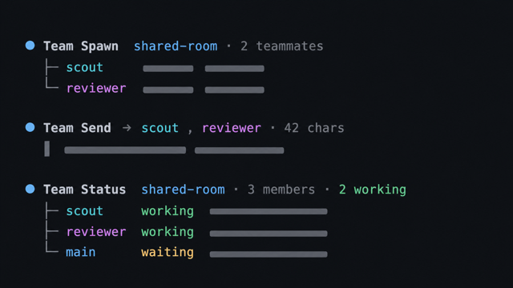
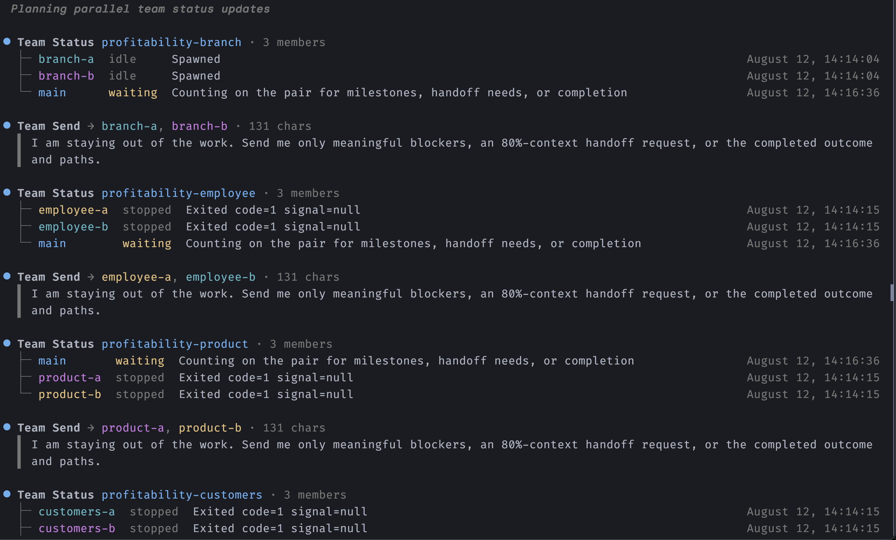
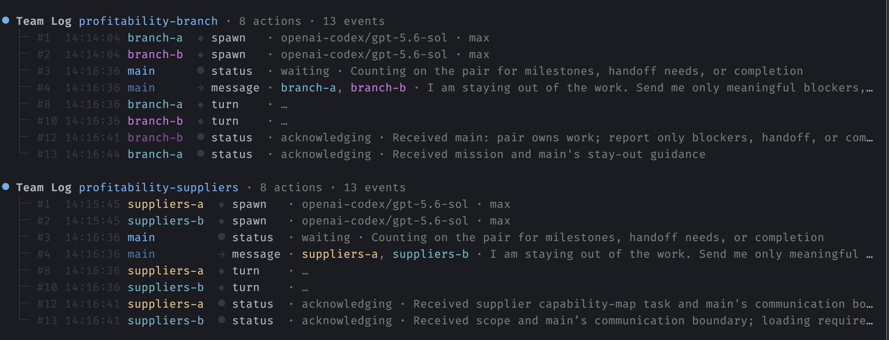
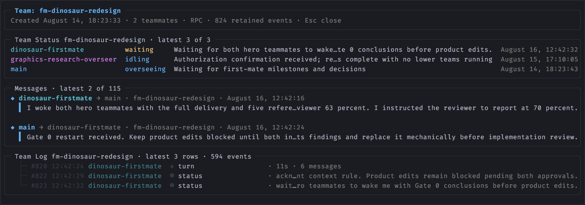
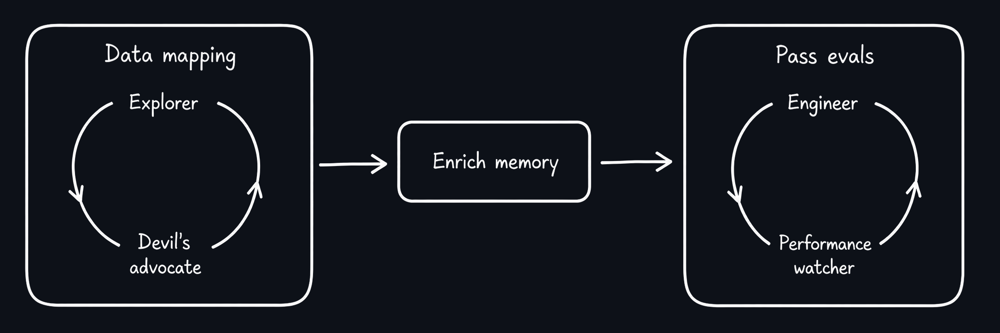

<div align="center">

# pi-simple-team

> **The team extension with no features.**

[](https://github.com/earendil-works/pi)
[](https://www.npmjs.com/package/@giladbarnea/pi-simple-team)
[](https://github.com/giladbarnea/pi-simple-team/actions/workflows/test.yml)
[](LICENSE)
[](https://www.typescriptlang.org/)
[](https://bun.sh/)

**No roles. No org chart. No mailboxes. No routing rules.**

`pi-simple-team` spawns a small team of Pi agents that can all talk to each other, like the responsible adults they are, **and then stays out of the way.**

</div>

---


## Why

I did my best work in a small room, together with a bunch of very capable people.

> <span style="color:grey">_[shouts]_</span> Has anyone figured out how to set up auth yet?

Not filing a "request for assistance".

> <span style="color:grey">_[taps shoulder]_</span> Dude can you grill me on this plan?

Not scheduling a meeting.

**That's the whole design. Not a swarm, not a company. *A room.***

## Install

```sh
pi install npm:@giladbarnea/pi-simple-team
```

## Using `pi-simple-team`

Tell your main agent:
> Spawn a team.

That's it. The team takes the shape of the mission:

You:
> Create an implementer-reviewer team to complete `PLAN.md`.

Main agent:
> Pair created. They'll loop through it together. They'll let me know when they're done.

[](screenshots/abstract-tool-output-preview.png)

<div align="center"><em>Spawn, direct, and follow a team from the normal Pi conversation.</em></div>

<br>

<details>
<summary><strong>pi-simple-team screenshots</strong></summary>

<br>

<p align="center">
  <a href="screenshots/team-status-multiple.png"></a>
  </p>
  <p align="center">
  <a href="screenshots/team-log-multiple.png"></a>
</p>

</details>

### Watch a live team with `/team`.

`/team` is for you, not another agent tool. It gives you a live view of the room without turning the main agent into a status relay.

The command opens an overlay rolling recent statuses, messages, and a separate event log.

<a href="screenshots/team-view.png">
  
</a>

<div align="center"><em>The live, read-only <code>/team</code> dashboard.</em></div>


## The mechanics

### 🏋️ Woken up when needed. Works freely otherwise.

Tokens, intelligence and time are never wasted on busy-polling for messages.

Instead, `pi-simple-team` pushes messages to the recipients.

This is both efficient and effective:

- ✔ No inbox to forget.
- ✔ Context window stays lean.
- ✔ Unlocks arbitrary workflows.

### ⚡ Messages arrive _fast_.

- Sub-second, when the recipient is idle.
- The moment the current bout of work ends, when busy.

### 🟢 Statuses everyone can see.

Teammates publish a one-liner:

> <span style="color:grey">implementer  </span> Done, 89 tests green, awaiting review.

> <span style="color:grey">reviewer      </span> Reading implementation, will finalize review in a few minutes.

Your main agent calls `teamstatus` and understands exactly what is going on. Main does not ask teammates for updates or clutter their context.

### 🌡️ Context window self-awareness

Teammates know how much free context they have left.

Main agent knows its own and everyone else's too.

They will hand off work autonomously when it's time to say goodbye.

You can stop babysitting everyone's context window.

### 📣 Interrupts, when justified.

> _Situation: Late afternoon. Team finished production hotfix and started wrap up. There is one problem though._

- 17:32:00: Security scout spots a private SSH key not covered by `.gitignore`.
- 17:32:01: Release teammate sets status: _Ran `git add .`, preparing commit and push._
- 17:32:02: Scout immediately interrupts. Key never leaves the machine. Developer keeps their job.

### 📡 Live, zero-cost observability 

Your main uses `teamlog` when it needs to understand the chain of events in high granularity: a timestamped, filterable timeline of messages, tool calls, and lifecycle events.

### 🪟 Herdr Mode

`pi-simple-team` can give each teammate a Pi session in its own [Herdr](https://herdr.dev) pane. Just ask your main agent to do that.

- Live view of the room.
- Talk directly with teammates.

### 🧱 Teammates are durable Pi sessions.

A teammate is a normal Pi session with a team attachment. 

This means teammates survive shutdown, whole team or member by member.

Have a teammate do work, exit Pi entirely, come back tomorrow in a brand-new session: main wakes that same teammate into the new conversation, everything it learned intact.

You can even `/resume` a teammate session directly if you ever want a cozy one-on-one.

The full lifecycle and persistence rules live in [ARCHITECTURE.md](ARCHITECTURE.md).

## 🪾 Teams all the way down (optionally)

Tell main you want to give a teammate the ability to manage its own team(s).

This is a powerful technique to create a new layer of context breathing room.

That teammate will spawn, steer and observe its own team(s) without costing tokens to its siblings or parent.

The tradeoff, like any higher-order delegation, is reduced control: you are moved one level further away from the action.

This is opt-in: teammates by default can't create teams.

---

## 🧬 Graphs engineer themselves

**Because** it does nothing special, `pi-simple-team` can construct any team graph you need:

You:
> **Team goal:**
> 1. Map all customer–product money streams in the database.
> 2. Feed this knowledge into the harness.
> 3. Prove the data analysis agent passes the new evals.
> 
> **Note:**
> - #1 and #3 are _saturation loops._ Stop only when you can't find anything new. 
> - Let teammates #1 and #3 create their own teams to loop until task is complete.

That prompt gives you this graph:



## Tools

Kept minimal:


| Role | For | Tools |
| --- | --- | --- |
| **Main agent** | Team lifecycle | `team_spawn`, `team_list`, `team_resume`, `team_add`, `team_shutdown` |
| | With team | `teamsend` |
| | On team | `teamstatus`, `teamlog` |
| | On everyone | `report_context_window` |
| **Overseeing teammate** | On own teams | Same tools as the main agent |
| | With parent team | `teamsend`, `teamstatus`, `teammain` |
| **Teammates** | With team | `teamsend` |
| | With main | `teammain` |
| | On self | `report_context_window` |
| **Everyone** | For everyone | `teamstatus` |


---


## Roadmap

**User involvement track:**

- [x] Herdr panes for teammates.
- [x] `/team`: live, read-only team dashboard.
- [ ] Teammate drill-down and transcripts.
- [ ] Joining and steering teams from slash commands.
- [ ] Adding teammates to existing teams directly from slash commands.
- [ ] Spawning teams directly from slash commands.

**Functional:**

- [x] Resume all or selected teammates from a dormant team.
- [x] Add new teammates after a team has spawned.
- [x] Let opted-in teammates create and manage teams of their own.
- [ ] Main forces `/compact` on select teammate.
- [ ] Teammates auto-reminded to hand off on low context.
