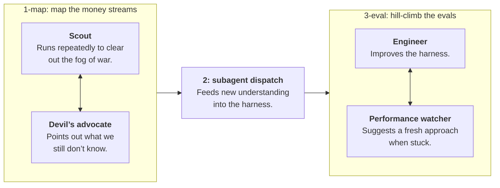

<div align="center">

# pi-simple-team

> **The team extension with no features.**

[](https://github.com/earendil-works/pi)
[](https://www.npmjs.com/package/@giladbarnea/pi-simple-team)
[](https://github.com/giladbarnea/pi-simple-team/actions/workflows/test.yml)
[](LICENSE)
[](https://www.typescriptlang.org/)
[](https://bun.sh/)

**No roles. No org chart. No mailboxes. No routing rules.**

`pi-simple-team` spawns a flat team of Pi agents that can all talk to each other, like the responsible adults they are, **and then stays out of the way.**

</div>

---


## Why

I've always done my best work in a small room with a few capable people, building something together.

> <span style="color:grey">_[shouts]_</span> Has anyone figured out how to set up auth yet?

Not filing a "request for assistance".

> <span style="color:grey">_[taps shoulder]_</span> Dude can you grill me on this plan?

Not scheduling a meeting.

**That's the whole design. Not a swarm, not a company. *A room.***

## Using `pi-simple-team`

Tell your main agent:
> Spawn a team.

### Throw a team at something hard.

The team takes the shape of the mission.

**Basic example: adversarial pair**

You:
> Create an implementer-reviewer team to complete `PLAN.md`.

Main agent:
> Pair created. They'll loop through it together. They'll let me know when they're done.

<br>

**Better example: build an agentic graph**

You:
> **Team goal:**
> 1. map out all customer–product money streams in the database.
> 2. Feed this knowledge into the harness.
> 3. Then prove the data analysis agent passes the new evals.
> 
> **Note:**
> - #1 and #3 are _loops._ Call them `1-map` and `3-eval`.
> - `1-map` and `3-eval` each gets a teamate.
> - Each teammate spawns _its own team_ to loop on its task.

<br>

<center>
<b>Because</b> it does nothing specially, <code>pi-simple-team</code> can construct any topography you wish it to.
</center>
<br>
That prompt gives you this graph:



<br>

---

<br>


<div align="center"><em><code>pi-simple-team</code> in the TUI.</em></div>

## The mechanics

### 🏋️ Woken up when needed. Works freely otherwise.

Tokens, intelligence and time are never wasted on busy-polling for messages.

Instead, `pi-simple-team` pushes messages to the receipients.

This is both efficient and effective:

- ✔ No inbox to forget.
- ✔ Context window stays lean.
- ✔ Unlocks teams doing arbitrary workflows.

*{screenshot of Codex filling up the entire visible chat with countless* `Waiting agents to finish...`*}*

### ⚡ Messages arrive _fast_.

- Sub-second, when the recipient is idle.
- The moment the current bout of work ends, when busy.

### 🟢 Statuses everyone can see.

Teammates publish a one-liner:

> <span style="color:grey">Implementer</span> Done, 89 tests green, awaiting review.

> <span style="color:grey">Reviewer</span> Reading implementation, will finalize review in a few minutes"

Your main agent calls `teamstatus` and understands exactly what's going on without asking and cluttering the teammates' context.

`report_context_window` reports selected teammates plus main, while each teammate can report its own context window.

### 📣 Interrupts, when the situation calls for it.

*Team has finished a production hotfix and started to wrap up.*

- Security scout spots a private SSH key not covered by `.gitignore`.
- At the same time, Release teammate sets status: "Ran `git add .`, preparing commit and push."
- Scout immediately interrupts them. Key never leaves the machine. Developer keeps their job.

### 📡 Complete observability by design.

The main agent can access one exhaustive, **timestamped history** of tool calls, messages, and lifecycle events, **recorded by the harness itself.**

Main can filter and page that shared timeline on demand.

Useful for tracing a failure *across* teammates—without asking anyone to reconstruct it from memory.

### 🪟 Herdr, first-class.

`pi-simple-team` gives each teammate a Pi session in its own [Herdr](https://herdr.dev) pane. Just ask your agent to do that.

You get a live view of the room. Main and teammates keep using the same tools.

<br>


<div align="center"><em>Visual representation of the team log.</em></div>

## Install

```sh
pi install npm:@giladbarnea/pi-simple-team
```


## Tools


Kept minimal:


| Role           | For            | Tools                         |
| -------------- | -------------- | ----------------------------- |
| **Main agent** | Team lifecycle | `team_spawn`, `team_shutdown` |
|                | With team      | `teamsend`                    |
|                | On team        | `teamstatus`, `teamlog`       |
| **Teammates**  | With teammates | `teamsend`                    |
|                | With main      | `teammain`                    |
|                | For everyone   | `teamstatus`                  |


---


## Roadmap


### User involvement track

Slash commands for:

- [ ] 💠 Live control panel.
- [ ] 👋 Joining and steering teams.
- [ ] 🪄 Spawning teams directly.
