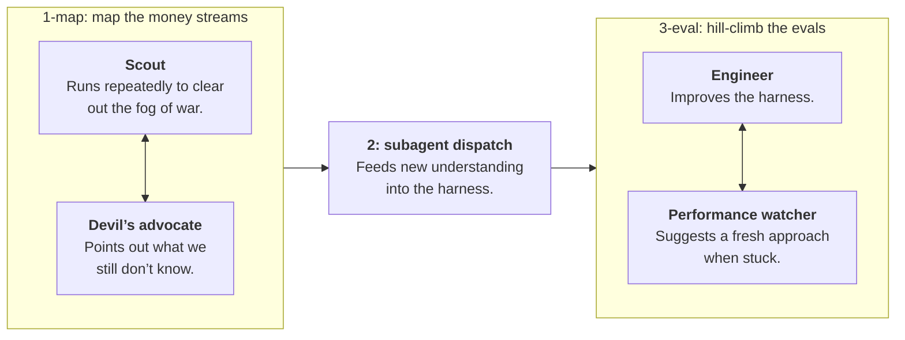
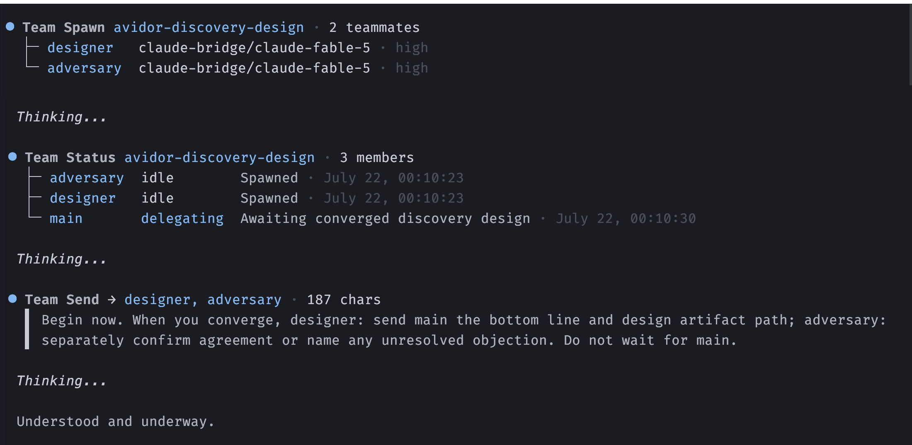
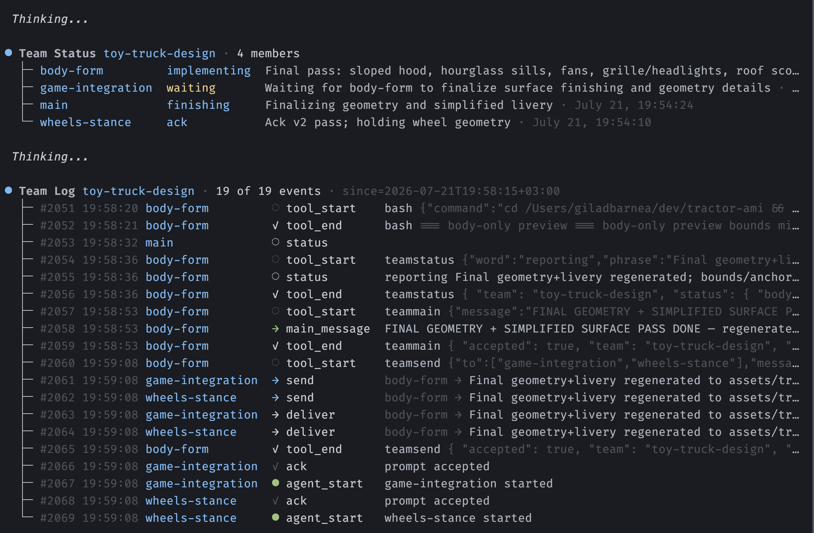

<div align="center">

# pi-simple-team

> **The team extension with no features.**

[](https://github.com/earendil-works/pi)
[](https://www.npmjs.com/package/@giladbarnea/pi-simple-team)
[](https://github.com/giladbarnea/pi-simple-team/actions/workflows/test.yml)
[](LICENSE)
[](https://www.typescriptlang.org/)
[](https://bun.sh/)

**No roles. No org chart. No mailboxes. No routing rules.**

`pi-simple-team` spawns a flat team of Pi agents that can all talk to each other, like the responsible adults they are, **and then stays out of the way.**

</div>

---


## Why

I've always done my best work in a small room with a few capable people, building something together.

> <span style="color:grey">_[shouts]_</span> Has anyone figured out how to set up auth yet?

Not filing a "request for assistance".

> <span style="color:grey">_[taps shoulder]_</span> Dude can you grill me on this plan?

Not scheduling a meeting.

**That's the whole design. Not a swarm, not a company. *A room.***

## Using `pi-simple-team`

Tell your main agent:
> Spawn a team.

### Watch a live team with `/team`.

`/team` is for you, not another agent tool. It gives you a live view of the room without turning the main agent into a status relay.

The command opens a read-only overlay with recent statuses, messages, and a separate event log. With no teams, it shows an empty state. With one team, it opens that team directly. With several teams, it starts with a selector.

The fixed layout keeps the latest content in view as work arrives, without scrolling or jumping around. It is an overview of the room, not a teammate drill-down or transcript.

### Throw a team at something hard.

The team takes the shape of the mission.

**Basic example: adversarial pair**

You:
> Create an implementer-reviewer team to complete `PLAN.md`.

Main agent:
> Pair created. They'll loop through it together. They'll let me know when they're done.

<br>

**Better example: build an agentic graph**

You:
> **Team goal:**
> 1. map out all customer–product money streams in the database.
> 2. Feed this knowledge into the harness.
> 3. Then prove the data analysis agent passes the new evals.
> 
> **Note:**
> - #1 and #3 are _loops._ Call them `1-map` and `3-eval`.
> - `1-map` and `3-eval` each gets a teamate.
> - Each teammate spawns _its own team_ to loop on its task.

<br>

<center>
<b>Because</b> it does nothing specially, <code>pi-simple-team</code> can construct any topography you wish it to.
</center>
<br>
That prompt gives you this graph:



<br>

---

<br>



<div align="center"><em><code>pi-simple-team</code> in the TUI.</em></div>

## The mechanics

### 🏋️ Woken up when needed. Works freely otherwise.

Tokens, intelligence and time are never wasted on busy-polling for messages.

Instead, `pi-simple-team` pushes messages to the receipients.

This is both efficient and effective:

- ✔ No inbox to forget.
- ✔ Context window stays lean.
- ✔ Unlocks teams doing arbitrary workflows.

*{screenshot of Codex filling up the entire visible chat with countless* `Waiting agents to finish...`*}*

### ⚡ Messages arrive _fast_.

- Sub-second, when the recipient is idle.
- The moment the current bout of work ends, when busy.

### 🟢 Statuses everyone can see.

Teammates publish a one-liner:

> <span style="color:grey">implementer  </span> Done, 89 tests green, awaiting review.

> <span style="color:grey">reviewer      </span> Reading implementation, will finalize review in a few minutes.

Your main agent calls `teamstatus` and understands exactly what's going on. Main doesn't ask and clutter the teammates' context.

### 🌡️ Context window self-awareness

Teammates know how much free context they have left.

Main agent knows its own and everyone else's too.

### 📣 Interrupts, when justified.

> _Situation: Late afternoon. Team has finished a production hotfix and started to wrap up._

- 17:32:00: Security scout spots a private SSH key not covered by `.gitignore`.
- 17:32:01: Release teammate sets status: "Ran `git add .`, preparing commit and push."
- 17:32:02: Scout immediately interrupts. Key never leaves the machine. Developer keeps their job.

### 📡 Live observability without a second history.

While a team runs, `teamlog` exposes a timestamped, filterable timeline of messages, tool calls, and lifecycle events.

That live timeline stays in parent-process memory and starts fresh after a resume. Pi session JSONL files are the canonical conversation history.

`pi-simple-team` does not persist a separate parent-runtime log or duplicate `teamlog` data.

<br>


<div align="center"><em>Visual representation of the team log.</em></div>

### 🪟 Herdr Mode

`pi-simple-team` can give each teammate a Pi session in its own [Herdr](https://herdr.dev) pane. Just ask your main agent to do that.

- Live view of the room.
- Talk directly with teammates.

### 🧱 Teammates are durable Pi sessions.

A teammate is a normal Pi session with a team attachment and an optional live runtime. The attachment adds its team prompt, roster, and communication tools.

Each team ID is `{origin-main-session-id}-{team-name}`. `team_list` discovers active and dormant teams from the same canonical project directory.

`team_shutdown` stops every live runtime and leaves the team dormant. Its manifest expires after 30 days, but expiration never deletes Pi session files.

`team_resume` starts all stopped teammates by default, or only selected teammates. Resume uses RPC unless `showOnHerdrPanes` is explicitly set.

Pi creates a session path before it writes the session JSONL file. A teammate without a first assistant response therefore restarts empty.

A missing file that once held session history causes resume to fail. Persisted sessions restore their own model and thinking state from Pi.

`team_add` creates new RPC teammates only for a running team owned by the current main session.

**One Pi session can have only one live runtime.** Pi does not lock session files against concurrent writers.


## Install

```sh
pi install npm:@giladbarnea/pi-simple-team
```


## Tools


Kept minimal:


| Role           | For            | Tools                                                            |
| -------------- | -------------- | ---------------------------------------------------------------- |
| **Main agent** | Team lifecycle | `team_spawn`, `team_list`, `team_resume`, `team_add`, `team_shutdown` |
|                | With team      | `teamsend`                                                       |
|                | On team        | `teamstatus`, `teamlog`                                          |
|                | On everyone    | `report_context_window`                                          |
| **Teammates**  | With team      | `teamsend`                                                       |
|                | With main      | `teammain`                                                       |
|                | On self        | `report_context_window`                                          |
| **Everyone**   | For everyone   | `teamstatus`                                                     |


---


## Roadmap

**User involvement track:**

- [x] Herdr panes for teammates.
- [x] `/team`: live, read-only team dashboard.
- [ ] Teammate drill-down and transcripts.
- [ ] Joining and steering teams from slash commands.
- [ ] Spawning teams directly from slash commands.

**Functional:**

- [x] Resume all or selected teammates from a dormant team.
- [x] Add new teammates after a team has spawned.
- [ ] Main forces `/compact` on select teammate.
